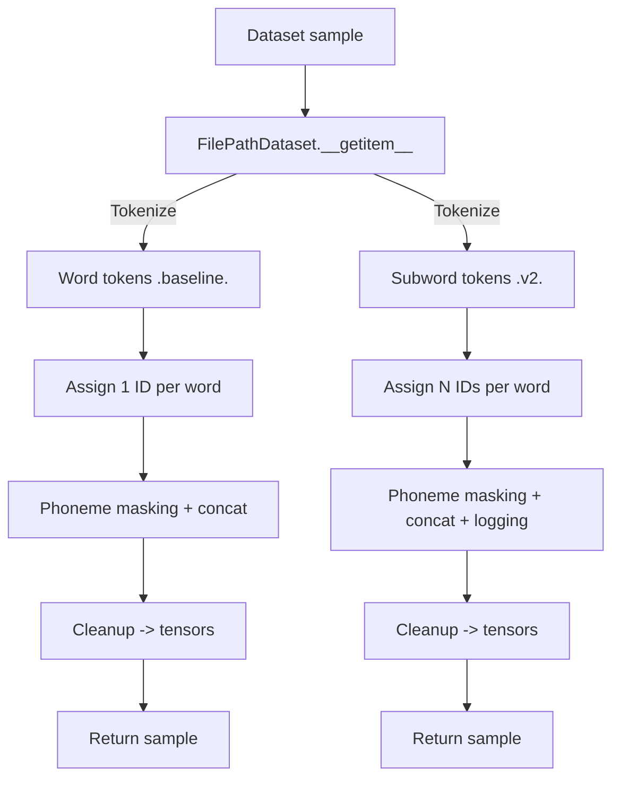
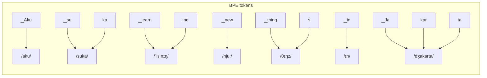
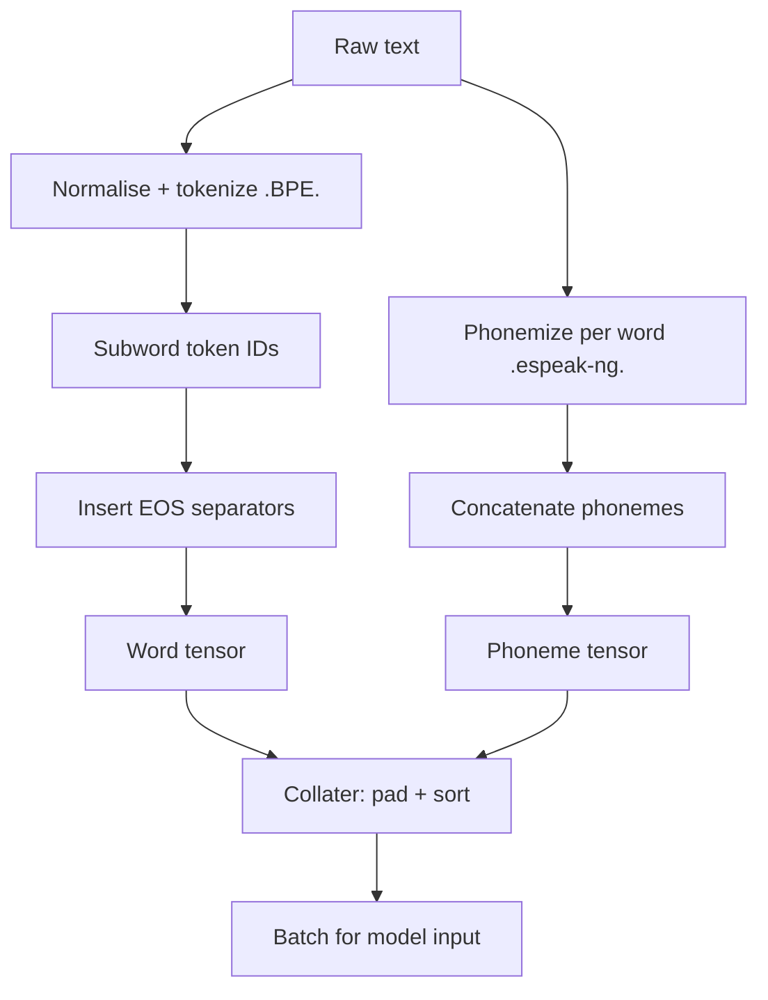

# FilePathDataset and Collater Comparison

## Overview

| Aspect | PL-BERT (word-level baseline) | PL-BERT v2 (subword/BPE) |
| --- | --- | --- |
| Primary languages | English | Indonesian–English mixed |
| Tokenizer | `transfo-xl-wt103` (word-level) | `GoToCompany/llama3-8b-cpt-sahabatai-v1-instruct` (BPE) |
| Token mapping | Serialized `token_maps.pkl` | Direct from Hugging Face `AutoTokenizer` |
| Alignment | 1 word ↔ 1 token ↔ 1 phoneme | 1 word ↔ N subwords ↔ 1 phoneme |
| Phoneme masking | Word-level | Word-level with per-phoneme probability |
| Logging | Minimal | Optional verbose logging per step |
| Language coverage | English only | Multilingual via `espeak-ng` + Lingua |
| Padding / separators | Fixed integer separator (`3039`) | EOS token from tokenizer |
| Output tensors | `phonemes`, `words`, `labels`, `masked_index` | Same tensors + debug metadata |

## Dataset Flow



## Sample Input

Sentence used throughout the comparison:

> Aku suka learning new things in Jakarta

## Tokenization and Phoneme Output

### PL-BERT (word-level)

```python
input_ids = [15342, 20131, 953, 899, 714, 39, 54321]
phonemes  = ["Aku", "suka", "ˈlɜːnɪŋ", "njuː", "θɪŋz", "ɪn", "Jakarta"]
```

Key traits:
- Exactly one token per word.
- No subword segmentation.
- Non-English terms pass through without phonemic conversion.

### PL-BERT v2 (subword)

```python
input_ids = [
  [321, 45],
  [578, 902],
  [1049, 332],
  [221],
  [407, 15],
  [55],
  [611, 912, 57]
]
phonemes = ["aku", "suka", "ˈlɜːnɪŋ", "njuː", "θɪŋz", "ɪn", "dʒakarta"]
```

Key traits:
- Words may expand to multiple BPE tokens.
- Phonemes remain aligned at the word level.
- Bilingual coverage via automatic language detection.

## Masking and Augmentation

| Step | PL-BERT (baseline) | PL-BERT v2 |
| --- | --- | --- |
| Masking probability | `word_mask_prob = 0.15` | Same |
| Replacement policy | 50% chance of random phoneme replacement | Same |
| Mask symbol | Repeating `"M"` per phoneme character | Same |
| Random source | `phoneme_list` lookup | Same |
| Debug logging | None | Optional per-word trace (masking, replacement, truncation) |

Verbose log example (v2):

```
--- Word 3 ---
  phoneme_word  : ˈlɜːnɪŋ
  bpe_ids       : [1049, 332]
  subword_tokens: ['▁learn', 'ing']
  -> phoneme masked: MMMMMMMM
```

## Output from `__getitem__`

```
phonemes_tensor : LongTensor([...])
words_tensor    : LongTensor([token_ids + eos])
labels_tensor   : LongTensor([...])
masked_index    : list[int]
```

Additional behaviour in PL-BERT v2:
- Dynamic truncation if `mel_length > max_mel_length`.
- `masked_index` adjusted after truncation.
- Optional summary logs of the final tensors.

## Collater Behaviour

| Component | PL-BERT (baseline) | PL-BERT v2 |
| --- | --- | --- |
| Padding | Manual (`torch.zeros`) | `tokenizer.pad_token_id` |
| Sorting key | Approximate mel length | Phoneme length |
| Extra outputs | — | `token_lengths` (valid tokens per sample) |
| Logging | None | Optional batch summaries |
| Returned tuple | `(words, labels, phonemes, input_lengths, masked_indices)` | Same + `token_lengths` and debug output |

`token_lengths` masks EOS and PAD values, simplifying downstream CTC loss calculations.

## Batch Output Illustration

```
# Baseline
words.shape     = (4, 128)
phonemes.shape  = (4, 128)
labels.shape    = (4, 128)
input_lengths   = [120, 115, 100, 98]
masked_indices  = [...]

# PL-BERT v2
words.shape     = (4, 512)
phonemes.shape  = (4, 512)
labels.shape    = (4, 512)
input_lengths   = [490, 455, 430, 400]
token_lengths   = [78, 74, 69, 65]
```

## Phoneme–Subword Alignment

### Background

PL-BERT v2 combines subword tokenization with word-level phoneme sequences. The model therefore observes a many-to-one relationship: a single phoneme sequence maps to one word, while the word may contain several BPE tokens.

### Token and Phoneme Example

| Word | Subword tokens | Phoneme |
| --- | --- | --- |
| Aku | `['▁Aku']` | `/aku/` |
| suka | `['▁su', 'ka']` | `/suka/` |
| learning | `['▁learn', 'ing']` | `/ˈlɜːnɪŋ/` |
| new | `['▁new']` | `/njuː/` |
| things | `['▁thing', 's']` | `/θɪŋz/` |
| in | `['▁in']` | `/ɪn/` |
| Jakarta | `['▁Ja', 'kar', 'ta']` | `/dʒakarta/` |

### Alignment Diagram



Interpretation:
- Phoneme nodes stay word-aligned on the right.
- Multiple subword tokens may point to the same phoneme sequence.
- CTC loss tolerates differing sequence lengths, so strict 1:1 alignment is unnecessary.

### Numerical Representation

```json
{
  "input_ids": [
    [321, 45],
    [578, 902],
    [1049, 332],
    [221],
    [407, 15],
    [55],
    [611, 912, 57]
  ],
  "phonemes": [
    "aku",
    "suka",
    "ˈlɜːnɪŋ",
    "njuː",
    "θɪŋz",
    "ɪn",
    "dʒakarta"
  ]
}
```

During batching:
- Subword IDs are flattened with EOS separators (`words.extend(bpe_ids); words.append(eos_id)`).
- Phoneme strings are concatenated (`phoneme += phoneme_word + " "`), then normalised.
- Resulting tensors resemble:

```text
words_tensor   = [321, 45, eos, 578, 902, eos, 1049, 332, eos, ...]
phoneme_tensor = [a, k, u,  , s, u, k, a,  , ˈ, l, ɜ, ː, n, ɪ, ŋ, ...]
```

## Training Considerations

| Aspect | Notes |
| --- | --- |
| Alignment looseness (CTC) | CTC accepts length mismatches between token and phoneme sequences; no per-word padding needed. |
| Phoneme masking | Still applied per word; subword splits do not change the masking unit. |
| Subword flexibility | New vocabulary (loanwords, slang) tokenises without manual maps. |
| Loss characteristics | Longer token sequences increase computation slightly but improve robustness to code-switching. |

## End-to-End Pipeline



## Technical Takeaways

| Pipeline | Observations |
| --- | --- |
| PL-BERT (word-level baseline) | Simple 1:1 alignment for monolingual English experiments; relies on manual token maps. |
| PL-BERT v2 (subword/BPE) | Many-to-one alignment mirrors multilingual input, integrates directly with CTC, and scales without handcrafted maps. |
