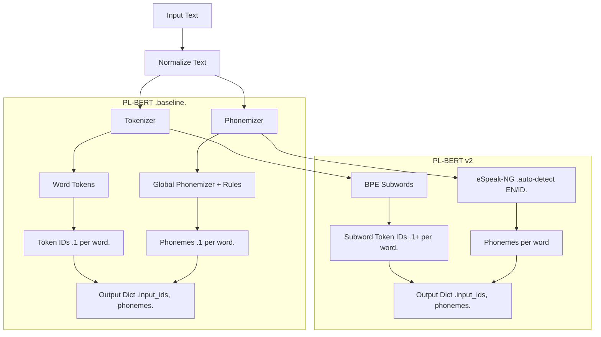

# Phonemization Pipeline Comparison

## Overview

| Aspect | PL-BERT (baseline) | PL-BERT v2 |
| --- | --- | --- |
| Primary language coverage | English | Mixed Indonesian–English |
| Tokenizer | Word-level (`transfo-xl-wt103`) | Subword BPE (`GoToCompany/llama3-8b-cpt-sahabatai-v1-instruct`) |
| Phonemization backend | `global_phonemizer` with handcrafted rules | `espeak-ng` CLI with Lingua-powered language detection |
| Phoneme inventory | English IPA only | IPA/X-SAMPA selected per detected language (`id` / `en-us`) |
| Unit alignment | 1 word ↔ 1 phoneme sequence | 1 word ↔ N subword tokens |
| Target dataset | Monolingual (English) | Bilingual (Indonesian–English) |
| Flexibility | Degrades rapidly outside English | Multilingual-ready via auto-detection + eSpeak voices |

## Processing Flow



## Example Input

Mixed-language sentence processed by both pipelines:

> Aku suka learning new things in Jakarta.

## Tokenization Comparison

### PL-BERT (word-level tokenizer)

Tokenizer: `transfo-xl-wt103`

| Word | Tokens | Token IDs (example) |
| --- | --- | --- |
| Aku | `['Aku']` | `[15342]` |
| suka | `['suka']` | `[20131]` |
| learning | `['learning']` | `[953]` |
| new | `['new']` | `[899]` |
| things | `['things']` | `[714]` |
| in | `['in']` | `[39]` |
| Jakarta | `['Jakarta']` | `[54321]` |
| . | `['.']` | `[4]` |

Key takeaways:
- Exactly one token per word.
- No subword segmentation.
- Non-English vocabulary frequently falls back to identity mapping.

### PL-BERT v2 (BPE tokenizer)

Tokenizer: `GoToCompany/llama3-8b-cpt-sahabatai-v1-instruct`

| Word | Subword tokens | Token IDs (example) |
| --- | --- | --- |
| Aku | `['▁Aku']` | `[321]` |
| suka | `['▁su', 'ka']` | `[578, 902]` |
| learning | `['▁learn', 'ing']` | `[1049, 332]` |
| new | `['▁new']` | `[221]` |
| things | `['▁thing', 's']` | `[407, 15]` |
| in | `['▁in']` | `[55]` |
| Jakarta | `['▁Ja', 'kar', 'ta']` | `[611, 912, 57]` |
| . | `['.']` | `[3]` |

Key takeaways:
- Long or rare words split into multiple subwords.
- Shared multilingual vocabulary covers Indonesian and English terms.
- Robust against out-of-vocabulary words due to subword decomposition.

## Phonemization Comparison

### PL-BERT (English-only rules)

| Word | Phoneme |
| --- | --- |
| Aku | `Aku` (unrecognized, passed through verbatim) |
| suka | `suka` |
| learning | `ˈlɜːnɪŋ` |
| new | `njuː` |
| things | `θɪŋz` |
| in | `ɪn` |
| Jakarta | `Jakarta` (unrecognized, passed through) |
| . | `.` |

Characteristics:
- Produces English IPA only.
- Applies handcrafted overrides (e.g., `"the"` → `ðɪ` before vowels).
- Lacks language detection; non-English words are returned unchanged.

### PL-BERT v2 (auto-detected languages)

`phonemize_word()` detects the language for each token using Lingua, then calls `espeak-ng` with the corresponding voice.

| Word | Detected language | Phoneme (IPA example) |
| --- | --- | --- |
| Aku | `id` | `/aku/` |
| suka | `id` | `/suka/` |
| learning | `en-us` | `/ˈlɜːnɪŋ/` |
| new | `en-us` | `/njuː/` |
| things | `en-us` | `/θɪŋz/` |
| in | `en-us` | `/ɪn/` |
| Jakarta | `id` | `/dʒakarta/` |
| . | `-` | `.` |

Characteristics:
- Language-aware phonemization yields bilingual phoneme sequences.
- Optional stress removal via `keep_stress=False`.
- Mixed phoneme inventory mirrors the detected language at the word level.

## Output Structure

### PL-BERT

```json
{
  "input_ids": [15342, 20131, 953, 899, 714, 39, 54321, 4],
  "phonemes": ["Aku", "suka", "ˈlɜːnɪŋ", "njuː", "θɪŋz", "ɪn", "Jakarta", "."]
}
```

### PL-BERT v2

Subword granularity introduces multiple token IDs per word:

```json
{
  "input_ids": [
    [321],
    [578, 902],
    [1049, 332],
    [221],
    [407, 15],
    [55],
    [611, 912, 57],
    [3]
  ],
  "phonemes": [
    "aku",
    "suka",
    "ˈlɜːnɪŋ",
    "njuː",
    "θɪŋz",
    "ɪn",
    "dʒakarta",
    "."
  ]
}
```

Notes:
- `input_ids` is a list of lists to preserve the alignment between subword tokens and their originating word.
- Phonemes remain word-aligned, enabling downstream CTC to resolve subword alignment implicitly.

## Design Considerations

| Aspect | Pipeline impact |
| --- | --- |
| Tokenizer granularity | BPE expands vocabulary coverage and smooths handling of unseen words. |
| Phoneme alignment | Requires careful mapping for `1 phoneme sequence ↔ N subwords`; handled downstream by CTC. |
| CTC loss | Fully compatible because CTC tolerates differing sequence lengths. |
| Runtime | Slightly higher due to per-token language detection and `espeak-ng` subprocesses. |
| Bilingual phonetic accuracy | Improved via language-specific phoneme inventories. |
| Debugging | Logging token counts and sample outputs remains essential for quality checks. |
